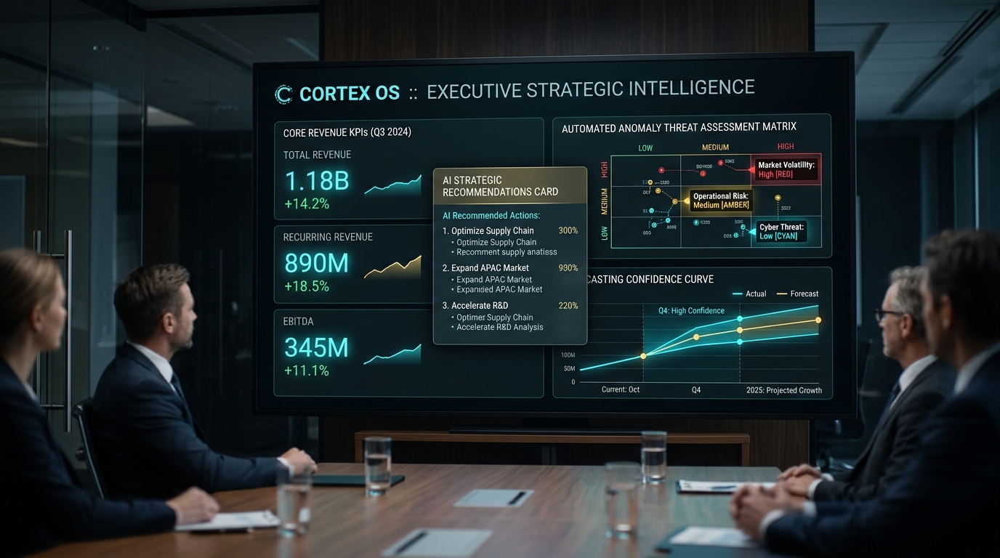

<div align="center">

# 🧠 CORTEX OS

### *The Operating System for Enterprise Intelligence*
**A Cinematic, Autonomous Enterprise Intelligence Interface & Real-Time Client-Side Analytics Engine**

[](https://react.dev/)
[](https://vitejs.dev/)
[](#-autonomous-multi-agent-pipeline)
[](#-privacy--zero-egress-guarantee)
[](LICENSE)

<br/>


<br/><br/>

**CORTEX OS** reimagines business intelligence and executive reporting from the ground up as a **living, cybernetic operating system**. Instead of static grids and stale charts, CORTEX operates as an autonomous cognitive intelligence core: drop in any raw CSV or Excel dataset, and CORTEX autonomously profiles the schema, detects anomalies, forecasts time-series trajectories, renders an adaptive dashboard, and synthesizes an executive boardroom presentation.

**Zero configuration. Zero backend requirement. 100% processed securely in browser memory.**

[✨ Features Matrix](#-core-capabilities--features) • [🤖 Multi-Agent Pipeline](#-autonomous-multi-agent-pipeline) • [📸 Visual Showcase](#-visual-showcase) • [⚡ Command Palette](#-command-palette--shortcuts) • [🏛️ Architecture](#-system-architecture) • [🚀 Getting Started](#-getting-started)

</div>

---

## 📸 Visual Showcase

<div align="center">

### 1. Autonomous Multi-Agent AI Pipeline
*Seven autonomous agents orchestrate data extraction, cleaning, statistical profiling, time-series forecasting, and strategic synthesis.*


<br/><br/>

### 2. Executive Presentation & Boardroom Mode
*One-click instantaneous conversion of raw analytical findings into high-impact boardroom slide decks.*



</div>

---

## ⚡ Core Capabilities & Features

### 🌌 Cinematic Sentience Layer
- **Self-Escalating Threat Levels**: Atmospheric state transitions across **`NOMINAL`** (cyan calm), **`ELEVATED`** (amber warning), and **`CRITICAL`** (crimson alert) based on real statistical data anomalies.
- **Proactive Thought Stream**: System thinks out loud with streaming rationale telemetry, audit trails, and agent coordination.
- **Living Neural Canvas**: Pure CSS and SVG hardware-accelerated particle network with dynamic synaptic firing pulses and atmospheric scanlines.

### 📊 Real-Time Autonomous Analytics
- **Multi-Format Ingestion**: Streaming chunk-based CSV/TSV parsing via PapaParse and full binary multi-sheet Excel (.xlsx/.xls) processing via SheetJS.
- **Automatic Schema Inference**: Heuristic column classification (numeric metrics, date dimensions, categorical groupings, ID flags) with data quality health scoring.
- **Statistical Forecasting**: Least-squares linear trend modeling with R²-normalized confidence interval bands and automatic outlier detection using two-tailed Z-scores.
- **Contextual Visualization Agent**: Dynamically selects optimal chart primitives (time-series trendlines, categorical bar breakdowns, variance distributions) based on data density.

### 👔 Executive Boardroom Presentation
- **1-Click Presentation Deck**: Automatically translates complex statistical data into polished, high-level narrative slides with key takeaways, risks, and strategic initiatives.
- **Keyboard-Driven Control**: Space / Arrow keys for intuitive navigation, full-screen HUD immersion, and quick exit.

### 🛡️ Privacy & Zero-Egress Guarantee
- **Pure Client-Side Computation**: Entire analytics, machine-learning heuristics, and rendering lifecycle occur in your browser's ephemeral RAM.
- **Zero Cloud Leakage**: No uploaded files or sensitive corporate records ever touch third-party cloud servers.

---

## 🤖 Autonomous Multi-Agent Pipeline

When a file is introduced into CORTEX OS, seven specialized autonomous agents activate sequentially to transform raw rows into actionable executive intelligence:

```mermaid
flowchart LR
    A["Raw Dataset\n(CSV / XLSX)"] --> B["Ingestion Agent\nStreamed Chunk Parser"]
    B --> C["Cleaning Agent\nSchema and Quality Scorer"]
    C --> D["Insight Agent\nKPI and Metrics Inferrer"]
    D --> E["Forecast Agent\nTrend and Z-Score Anomaly"]
    E --> F["Visualization Agent\nContextual Chart Selector"]
    F --> G["Reporting Agent\nExecutive Narrative Generator"]
    G --> H["Strategy Agent\nRisk and Strategic Guidance"]
    H --> I["Living Intelligence Core\nInteractive HUD + Presentation Deck"]

    style A fill:#0A0E17,stroke:#00D4FF,stroke-width:2px,color:#FFFFFF
    style B fill:#0A0E17,stroke:#00D4FF,stroke-width:2px,color:#FFFFFF
    style C fill:#0A0E17,stroke:#00D4FF,stroke-width:2px,color:#FFFFFF
    style D fill:#0A0E17,stroke:#7B2FFF,stroke-width:2px,color:#FFFFFF
    style E fill:#0A0E17,stroke:#7B2FFF,stroke-width:2px,color:#FFFFFF
    style F fill:#0A0E17,stroke:#00FF9D,stroke-width:2px,color:#FFFFFF
    style G fill:#0A0E17,stroke:#FFB800,stroke-width:2px,color:#FFFFFF
    style H fill:#0A0E17,stroke:#FF0055,stroke-width:2px,color:#FFFFFF
    style I fill:#05070D,stroke:#00D4FF,stroke-width:3px,color:#FFFFFF
```



### Agent Roster & Responsibilities

| Agent | Core Function | Technical Pipeline |
| :--- | :--- | :--- |
| **Ingestion Agent** | High-throughput parsing | PapaParse streaming chunks / SheetJS binary array workbook extraction |
| **Cleaning Agent** | Schema inference and sanitation | Automated type coercion, missing value isolation, data quality index |
| **Insight Agent** | Macro aggregation | Aggregates full numeric arrays, computes means, medians, sums, and variances |
| **Forecast Agent** | Predictive modeling | Linear regression trend extrapolation with R² fit scoring and Z-score outlier alerts |
| **Visualization Agent** | Adaptive layout generation | Dynamic Recharts orchestration with responsive viewport scaling |
| **Reporting Agent** | Executive briefing synthesis | Converts mathematical variances into concise corporate briefings |
| **Strategy Agent** | Risk mitigation guidance | Formulates prioritised business action items based on detected bottlenecks |

---

## ⚡ Command Palette & Shortcuts

CORTEX OS provides an integrated, keyboard-first command interface accessible instantly from any screen:

| Shortcut | Action | Scope |
| :--- | :--- | :--- |
| <kbd>⌘</kbd> + <kbd>K</kbd> / <kbd>Ctrl</kbd> + <kbd>K</kbd> | Toggle Global Command Palette | Global |
| <kbd>P</kbd> | Launch Executive Presentation Mode | Dashboard |
| <kbd>Space</kbd> / <kbd>→</kbd> | Next Presentation Slide | Presentation Deck |
| <kbd>←</kbd> | Previous Presentation Slide | Presentation Deck |
| <kbd>Esc</kbd> | Close Overlays / Exit Presentation | Global |
| <kbd>F</kbd> | Toggle Fullscreen Mode | Global |
| <kbd>C</kbd> | Toggle AI Copilot Stream | Dashboard |

---

## 🏛️ System Architecture

```
cortex-os/
├── src/
│   ├── CortexOS.jsx            # Unified cybernetic HUD interface & presentation engine
│   ├── engine.js               # Modular, UI-agnostic data intelligence core & agent swarm
│   ├── cleaner.js              # Advanced data sanitizer & imputation utilities
│   ├── constants.js            # Design tokens, state definitions & telemetry configs
│   ├── components/             # Reusable UI widgets & micro-telemetry panels
│   ├── tabs/                   # Profiler, cleaner, and insights views
│   └── main.jsx                # Application mounting & root initialization
├── docs/
│   ├── ARCHITECTURE.md         # Detailed architectural & algorithmic specification
│   ├── DESIGN_SYSTEM.md        # Cyber-obsidian visual design language & tokens
│   └── images/                 # Flagship 4K media assets & architecture visuals
├── .github/workflows/ci.yml    # Continuous Integration automated build pipeline
├── package.json                # Project dependencies & npm scripts
└── vite.config.js              # Vite bundler configuration & production optimizations
```

For complete technical specifications, see:
- 📖 [**Technical Architecture Specification**](docs/ARCHITECTURE.md)
- 🎨 [**Cybernetic Design System Specification**](docs/DESIGN_SYSTEM.md)

---

## 🛠️ Getting Started

### Prerequisites
- **Node.js**: v18.0.0 or higher
- **npm** or **yarn** / **pnpm**

### Installation

1. **Clone the repository:**
   ```bash
   git clone https://github.com/EnternalBlue07/CORTEX-OS.git
   cd CORTEX-OS
   ```

2. **Install dependencies:**
   ```bash
   npm install
   ```

3. **Launch the development server:**
   ```bash
   npm run dev
   ```
   Open `http://localhost:5173` in your modern browser.

4. **Build production bundle:**
   ```bash
   npm run build
   ```

### Optional: AI Copilot Live Mode
To enable live streaming Anthropic Claude intelligence for conversational queries, duplicate `.env.example` to `.env` and configure your API key:

```env
VITE_ANTHROPIC_API_KEY=sk-ant-api03-...
```

*(If left unconfigured, CORTEX OS gracefully falls back to an offline simulated streaming copilot that operates entirely without external network requests).*

---

## 📋 Roadmap & Evolution

- [x] **Cinematic HUD Interface** — Hardware-accelerated particle canvas & reactive state machine
- [x] **Client-Side Intelligence Engine** — 7-agent autonomous analytics & forecasting pipeline
- [x] **Executive Presentation Engine** — Real-time auto-generated boardroom slide decks
- [x] **Autonomous Threat Escalation** — Dynamic visual atmospheric states (Nominal / Elevated / Critical)
- [x] **Comprehensive Documentation & Media Suite** — Flagship README, Architecture Spec & Design System
- [ ] **WASM High-Velocity Processing** — DuckDB-Wasm integration for datasets exceeding 1,000,000+ rows
- [ ] **Audio Feedback Synthesis** — Ambient cybernetic UI sound effects and audio status chirps
- [ ] **Multi-File Cross-Correlation Engine** — Automatic relational join detection across multiple datasets

---

## 📜 License

Distributed under the **MIT License**. See [`LICENSE`](LICENSE) for complete terms.

<div align="center">
  <sub>Engineered with precision for the future of enterprise decision intelligence.</sub>
</div>
