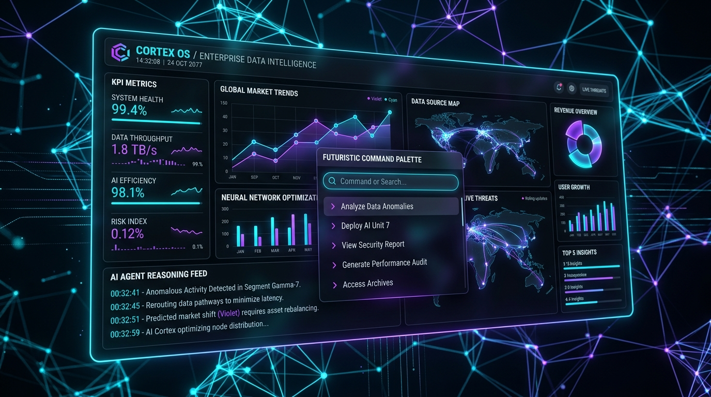
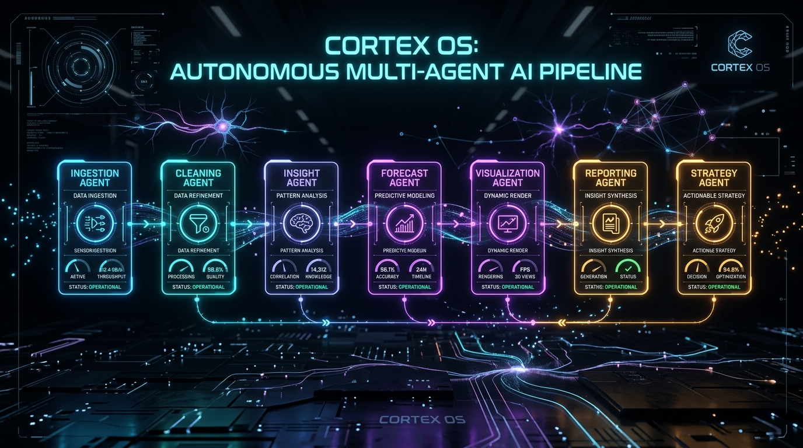
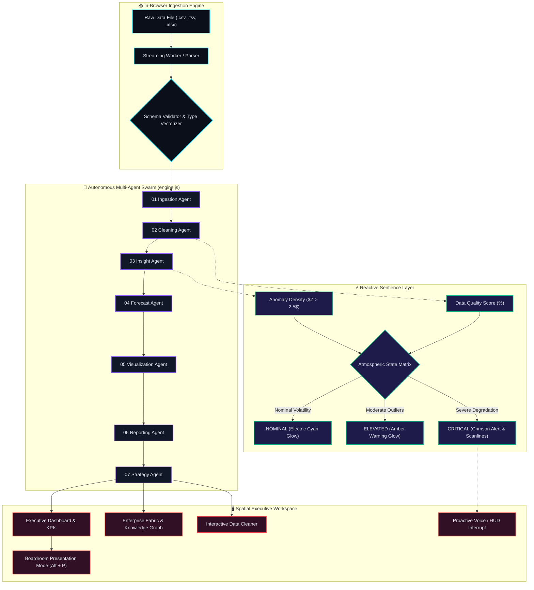

<div align="center">

# 🧠 CORTEX OS
### The Operating System for Enterprise Intelligence

_A cinematic, autonomous enterprise intelligence interface — drop in a dataset, and CORTEX profiles it, forecasts it, detects anomalies, builds an adaptive dashboard, and narrates an executive briefing. All client-side, in real time._

<br/>

[](https://github.com/EnternalBlue07/CORTEX-OS/actions/workflows/ci.yml)
[](https://react.dev)
[](https://vitejs.dev)
[](./docs/AGENTS_AND_INTELLIGENCE.md)
[](./docs/ARCHITECTURE.md)
[](./LICENSE)

<br/>



<br/>
<br/>

[**Explore Live Architecture**](./docs/ARCHITECTURE.md) • [**Design System**](./docs/DESIGN_SYSTEM.md) • [**Agent Swarm Spec**](./docs/AGENTS_AND_INTELLIGENCE.md) • [**Report Bug**](https://github.com/EnternalBlue07/CORTEX-OS/issues)

</div>

---

## 🌟 Executive Summary

Traditional business intelligence (BI) tools are static grids of forgotten dashboards that demand continuous manual querying, brittle ETL pipelines, and weeks of engineering overhead. 

**CORTEX OS reimagines enterprise analytics as a living, spatial intelligence environment.** It is an autonomous operating system designed for modern leadership and data engineering squads:
- **Instant Ingestion & Zero-Cloud Latency:** Drag & drop any CSV or Excel (`.xlsx`, `.xls`) file. CORTEX parses and classifies every column vector in-memory with **0 bytes of data egress** to external servers.
- **Autonomous Multi-Agent Core:** A synchronized swarm of 7 specialized AI agents orchestrates data ingestion, cleaning, distribution analysis, R²-normalized forecasting, and strategic risk assessment.
- **Adaptive Auto-Dashboard:** Automatically discovers dominant business KPIs, constructs confidence-bounded predictive curves, and flags statistical Z-score anomalies.
- **Executive Presentation Deck:** One-click conversion of live telemetry into a high-stakes, keyboard-driven boardroom presentation.

---

## ⚡ Autonomous 7-Agent Swarm Pipeline

When data enters CORTEX OS, it triggers an event-driven parallel pipeline managed in `src/engine.js`. Rather than relying on monolithic LLM prompts, CORTEX coordinates **7 autonomous, single-responsibility agents**:

<br/>

<div align="center">

</div>

<br/>

### Agent Breakdown

| Agent | Responsibility | Core Computation / Mechanics |
| :--- | :--- | :--- |
| **01. Ingestion Agent** | High-throughput streaming parse | Chunked PapaParse streaming for CSV/TSV; SheetJS binary workbook decoder for multi-sheet Excel files. Isolates bad rows without crashing. |
| **02. Cleaning Agent** | Schema inference & normalization | Heuristic type classification (`numeric`, `date`, `categorical`, `uuid`, `text`), Shannon entropy for unique identifiers, automated null imputation. |
| **03. Insight Agent** | Deep statistical profiling | Computes full-population mean, median, standard deviation, interquartile ranges (IQR), and Pearson correlation matrices. |
| **04. Forecast Agent** | Autoregressive trend modeling | Ordinary Least Squares (OLS) linear trend estimation with R²-normalized confidence intervals clamped by sample size: $Confidence = \text{clamp}(R^2 \cdot (1 - e^{-n/k}), 0.1, 0.99)$. |
| **05. Visualization Agent** | Adaptive layout synthesis | Contextual chart selection (Dual-area forecast bands, categorical distribution bars, anomaly scatter plots) with responsive scaling. |
| **06. Reporting Agent** | Narrative intelligence generation | Synthesizes executive briefings, identifies primary revenue engines vs cost leaks, and drafts strategic boardroom narratives. |
| **07. Strategy Agent** | Prescriptive action generation | Evaluates systemic risk, assigns severity scores (`LOW`, `MEDIUM`, `CRITICAL`), and generates actionable execution playbooks. |

---

## 🏛 System Architecture & Sentience Flow

CORTEX OS operates an autonomous **Sentience State Machine** that dynamically calculates the environmental threat level based on data health, anomaly density, and forecast volatility.



---

## 💼 Executive Boardroom Presentation Mode

With a single keystroke (`Alt + P` or `Cmd + P`), CORTEX OS collapses administrative panels into a **full-screen, high-definition cinematic boardroom slide deck**.

<br/>

<div align="center">

</div>

<br/>

### Key Capabilities:
- **Zero-Friction Boardroom Transitions:** Instantly strips away developer chrome, navigation drawers, and technical logs.
- **Narrated Slide Progression:** Auto-sequences slides across Executive Thesis, Core Revenue KPIs, Predictive Horizon, Anomaly Risk Matrix, and Strategic Action Plan.
- **Keyboard Driver:** Full arrow-key navigation (`Left` / `Right`), fullscreen toggle (`F`), and presentation escape (`Esc`).
- **Autonomous Speaker Notes:** Real-time AI generated bullet points explaining the statistical nuances behind each visual.

---

## 🎛️ Feature Matrix & Modular Tabs

CORTEX OS features 15 specialized workspace modules designed for multi-tier enterprise workflows:

| Tab Icon | Module | Core Functionality |
| :---: | :--- | :--- |
| 📊 | **Executive Dashboard** | Primary command center featuring inferred business KPIs, revenue horizons, and automated executive briefings. |
| 🌐 | **Enterprise Fabric** | Global latency and throughput nexus topology across Snowflake, BigQuery, Databricks, and S3 connectors. |
| 🔍 | **Data Profiler** | Deep statistical inspection: Null density, Cardinality, Skewness, Min/Max/Quartile distributions, and type assertions. |
| 🧼 | **Smart Cleaner** | Interactive data remediation tool: Outlier clipping, missing value imputation, duplicate removal, and clean CSV export. |
| 🔗 | **Relational Insights** | Pearson correlation heatmaps and automated dependency mapping between numerical columns. |
| 📈 | **Neural Forecasting** | Multi-horizon trend regression featuring confidence interval upper/lower envelopes and seasonality detection. |
| 🚨 | **Anomaly Grid** | Tabular and visual scatter map of records violating $Z > 2.5$ standard deviation thresholds. |
| 🛡️ | **Threat Analysis** | Enterprise risk matrix plotting business impact against probability of data drift and anomalies. |
| 🤖 | **AI Agent Swarm** | Live telemetry, thought chains, and confidence scores across the 7 autonomous intelligence engines. |
| 📑 | **Executive Reports** | Formal PDF/Print-ready boardroom documentation with embedded charts and strategic recommendations. |
| 🎯 | **Strategy Matrix** | Prescriptive operational playbook prioritizing immediate, mid-term, and long-term business maneuvers. |
| 🏛️ | **Governance Layer** | Compliance audit trails, data lineage verification, and PII/masking security flags. |
| ⚡ | **Live Operations** | Real-time system diagnostics, frame rate profiling, memory consumption, and background worker threads. |
| 💬 | **AI Copilot** | Anthropic Claude-backed streaming copilot (with instant offline simulation fallback for zero-setup demos). |
| ⚙️ | **Settings & Limits** | Configurable confidence thresholds, sample caps, theme parameters, and API credentials. |

---

## ⌨️ Command Palette & Power Shortcuts

CORTEX OS is engineered for ultra-fast keyboard operation. Hit `⌘ + K` or `Ctrl + K` anywhere to invoke the global command palette:

| Shortcut | Action | Description |
| :--- | :--- | :--- |
| `⌘ + K` / `Ctrl + K` | **Command Palette** | Fullscreen fuzzy search for all tabs, datasets, and operations |
| `Alt + P` / `Cmd + P` | **Presentation Mode** | Launch high-resolution boardroom slide deck |
| `G + D` | **Go to Dashboard** | Switch to Executive Dashboard & KPIs |
| `G + C` | **Go to Cleaner** | Open Data Cleaner & Remediation Suite |
| `G + S` | **Go to Profiler** | View Field Schema & Vector Statistics |
| `G + I` | **Go to Insights** | Open Relational Insights & Correlation Matrix |
| `Esc` | **Close Overlay** | Exit modal, presentation mode, or command palette |

---

## 🚀 Quick Start Guide

### Prerequisites
- **Node.js** v18.0.0 or higher
- **npm** v9.0.0 or higher

### 1. Clone & Install
```bash
# Clone the repository
git clone https://github.com/EnternalBlue07/CORTEX-OS.git
cd CORTEX-OS

# Install dependencies (React 18, Vite 5, Recharts, PapaParse, SheetJS)
npm install
```

### 2. Launch Local Development Server
```bash
npm run dev
```
Open your browser to `http://localhost:5173`. CORTEX OS will perform its signature neural boot sequence and land on the workspace.

### 3. (Optional) Configure Live Anthropic Claude Copilot
CORTEX OS works **100% out of the box with an intelligent offline simulator**. If you wish to connect it to live Anthropic Claude 3.5 Sonnet streaming:

```bash
cp .env.example .env
```
Add your API key inside `.env`:
```env
VITE_ANTHROPIC_API_KEY=sk-ant-api03-...
```

> ⚠️ **Security Notice:** `VITE_*` keys are client-accessible. For production deployments, always route LLM requests through a secure server-side API proxy.

### 4. Build for Production
```bash
npm run build
npm run preview
```

---

## 🧪 Testing with Sample Datasets

A production-grade sample dataset is included in the root directory:
- [`cortex_test_data.xlsx`](./cortex_test_data.xlsx): Multi-dimensional enterprise dataset containing revenue, churn rates, server latency, and regional transaction records.
- [`generate-test-data.mjs`](./generate-test-data.mjs): Script to generate synthetic enterprise telemetry files of arbitrary row sizes.

To generate a custom test dataset:
```bash
node generate-test-data.mjs --rows=5000
```

---

## 🔒 Privacy, Security & Compliance

```
┌─────────────────────────────────────────────────────────────┐
│                 BROWSER CLIENT SANDBOX                      │
│                                                             │
│   [User File (.csv/.xlsx)]                                  │
│              │                                              │
│              ▼                                              │
│   [In-Memory Stream Parser] ──► [Typed Array Storage]        │
│                                           │                 │
│                                           ▼                 │
│   [Local Swarm Agents (engine.js)] ◄──────┘                 │
│              │                                              │
│              ▼                                              │
│   [Reactive Spatial UI]                                     │
│                                                             │
│   ✖ ZERO Outbound Network Egress for Data Files             │
│   ✖ ZERO Third-Party Cloud Database Storage                 │
│   ✔ 100% Client-Side In-RAM Garbage Collection              │
└─────────────────────────────────────────────────────────────┘
```

1. **Client-Side Processing:** All parsing, statistical computations, and visualizations occur within the client's V8 engine instance.
2. **Ephemeral Memory Model:** When a dataset is closed, references are cleared and freed by the browser garbage collector.
3. **Zero Data Retention:** No customer financial records, PII, or internal telemetry are ever uploaded to cloud servers.

---

## 🗺️ Engineering Roadmap

- [x] **Autonomous 7-Agent Engine** (`src/engine.js`)
- [x] **Reactive Sentience State Machine** (Nominal / Elevated / Critical)
- [x] **In-Memory Streaming CSV & Binary Excel Ingestion**
- [x] **Executive Presentation Mode with Keyboard Controls**
- [x] **Smart Data Cleaning, Imputation & Remediation Suite**
- [x] **Continuous Integration Pipeline** (GitHub Actions build check)
- [ ] **WebAssembly Acceleration:** Rust-compiled Arrow/DuckDB engine for 10M+ row sub-second profiling.
- [ ] **Local LLM Integration:** Direct WebLLM / WebGPU integration (Llama 3 / Phi-3) running fully in-browser with zero API keys.
- [ ] **Collaborative Multi-User Sync:** P2P WebRTC data room for simultaneous executive review.

---

## 📄 License

This project is licensed under the **MIT License** - see the [LICENSE](./LICENSE) file for details.

---

<div align="center">
Built with ⚡ by <b>EnternalBlue07</b> & The CORTEX OS Core Team.<br/>
<i>Empowering enterprises with autonomous client-side intelligence.</i>
</div>
