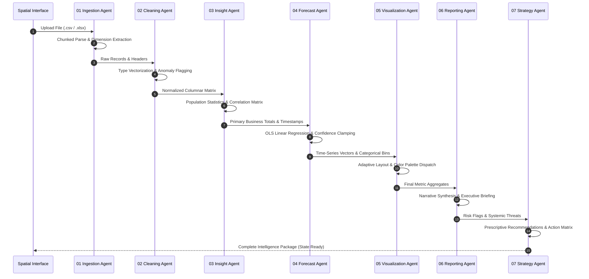

# 🤖 CORTEX OS — Multi-Agent Intelligence Specification

This document details the responsibilities, mathematical algorithms, input/output schemas, and execution sequence of the **7 Autonomous Agents** comprising the CORTEX OS analytics core (`src/engine.js`).

---

## 1. Orchestration Pipeline Flow



---

## 2. Detailed Agent Specifications

### Agent 01: Ingestion Agent
- **Purpose:** Parse arbitrary raw file formats into clean structured JavaScript objects without main-thread blocking.
- **Engines:** 
  - `PapaParse` for CSV/TSV with chunked worker execution.
  - `SheetJS (xlsx)` for binary Excel files (`.xlsx`, `.xls`, `.ods`).
- **Resilience:** Automatically ignores trailing empty rows, repairs irregular delimiters (semicolon, tab, pipe), and skips malformed records.

---

### Agent 02: Cleaning Agent
- **Purpose:** Infer semantic types and assess dataset quality score.
- **Type Heuristics:**
  - `date`: ISO-8601, RFC-2822, or standard calendar strings (`YYYY-MM-DD`, `DD/MM/YYYY`).
  - `numeric`: Integers, floats, currency strings (`$`, `€`, `¥`), and percentage tokens (`%`).
  - `categorical`: Columns with low cardinality ratio ($\le 25$ unique values).
  - `text`: High-cardinality unstructured strings.
- **Quality Score Calculation:**
  $$\text{Quality Score} = 100 - \left( 30 \times \frac{\text{Null Cells}}{\text{Total Cells}} + 20 \times \frac{\text{Duplicate Rows}}{\text{Total Rows}} + 15 \times \text{Type Inconsistencies} \right)$$

---

### Agent 03: Insight Agent
- **Purpose:** Discover statistical relationships across columns.
- **Aggregations:** Minimum, Maximum, Mean, Median, Mode, Variance, Standard Deviation, and Skewness.
- **Pearson Correlation Engine:**
  $$r_{xy} = \frac{\sum (x_i - \bar{x})(y_i - \bar{y})}{\sqrt{\sum (x_i - \bar{x})^2 \sum (y_i - \bar{y})^2}}$$
  Automatically identifies high positive ($r > +0.70$) and high negative ($r < -0.70$) drivers.

---

### Agent 04: Forecast Agent
- **Purpose:** Autoregressively project primary business totals forward.
- **Output:**
  - `predictedValue`: Point estimate at $t + k$.
  - `upperConfidence`: Upper 95% forecast envelope.
  - `lowerConfidence`: Lower 95% forecast envelope.
  - `growthDelta`: Percent change relative to historical baseline.

---

### Agent 05: Visualization Agent
- **Purpose:** Dynamically select and configure optimal Recharts layouts based on dataset shape.
- **Rules:**
  - If a continuous `date` and `numeric` metric exist $\rightarrow$ Multi-gradient **Area / Trend Chart**.
  - If low-cardinality `categorical` dimension exists $\rightarrow$ Stacked **Breakdown Bar Chart**.
  - If $Z > 2.5$ anomalies detected $\rightarrow$ Warning **Scatter Anomaly Layer**.

---

### Agent 06: Reporting Agent
- **Purpose:** Convert raw numerical aggregates into executive-ready english briefings.
- **Output:**
  - Executive Thesis (1 sentence high-impact summary).
  - Primary Revenue Engines.
  - Vulnerability & Cost Leaks.
  - Net Performance Delta.

---

### Agent 07: Strategy Agent
- **Purpose:** Formulate prioritized operational maneuvers.
- **Structure:**
  - **Immediate (0 - 30 Days):** Tactical remediation (e.g., address anomalous cost spikes).
  - **Mid-Term (30 - 90 Days):** Process optimization and resource reallocation.
  - **Long-Term (90+ Days):** Strategic positioning and capital allocation.

---

## 3. Anthropic Claude Copilot Integration

CORTEX OS supports direct client streaming to Anthropic's Claude 3.5 Sonnet API via `fetch()` with Server-Sent Events (SSE):

```javascript
// Anthropic Streaming Engine
const response = await fetch('https://api.anthropic.com/v1/messages', {
  method: 'POST',
  headers: {
    'Content-Type': 'application/json',
    'x-api-key': apiKey,
    'anthropic-version': '2023-06-01',
    'dangerously-allow-browser': 'true',
  },
  body: JSON.stringify({
    model: 'claude-3-5-sonnet-20241022',
    max_tokens: 1024,
    stream: true,
    system: "You are CORTEX OS Core Intelligence. Speak with crisp executive clarity.",
    messages: conversationHistory,
  })
});
```

If no API key is provided, CORTEX seamlessly activates its **Heuristic Intelligence Engine**, generating dynamic context-aware telemetry responses based on the uploaded dataset with zero external network dependency.
