# 🏛️ CORTEX OS — System Architecture Specification

This document details the architectural principles, mathematical engines, state machines, and data processing models powering **CORTEX OS: The Operating System for Enterprise Intelligence**.

---

## 1. Architectural Tenets

CORTEX OS is engineered on four non-negotiable architectural axioms:

1. **Zero Cloud Latency & Zero Egress:** Raw customer datasets (financials, healthcare metrics, customer telemetry) must never leave the client device. All vector classification, cleaning, anomaly computation, and regression occur inside client V8 memory.
2. **Autonomous Multi-Agent Specialization:** Monolithic LLMs are brittle, slow, and hallucination-prone on mathematical tasks. CORTEX delegates analytical workloads to 7 deterministic, single-responsibility engines (`src/engine.js`).
3. **Atmospheric Reactive Sentience:** Analytics dashboards must not be static tabular grids. The UI environment dynamically mutates its lighting, scanlines, and audio cues based on the statistical health and threat levels detected in the ingested data.
4. **Instant Boardroom Readiness:** Data teams spend hours copying chart screenshots into slide decks. CORTEX synthesizes an executive-grade, keyboard-driven presentation mode with automated talking points on demand.

---

## 2. High-Level System Architecture

```mermaid
graph TB
    subgraph Client ["Client Browser Runtime (V8 Engine)"]
        subgraph Ingestion ["Data Ingestion & Virtualization"]
            FileIn["Raw Input (CSV, TSV, XLSX, XLS)"]
            Parser["In-Memory Stream Parser (PapaParse / SheetJS)"]
            DataBuffer["Normalized Columnar Vector Store"]
        end

        subgraph CoreEngine ["Autonomous Engine (src/engine.js)"]
            Agent1["01 Ingestion Agent"]
            Agent2["02 Cleaning Agent"]
            Agent3["03 Insight Agent"]
            Agent4["04 Forecast Agent"]
            Agent5["05 Visualization Agent"]
            Agent6["06 Reporting Agent"]
            Agent7["07 Strategy Agent"]
        end

        subgraph SentienceStateMachine ["Sentience & Environmental Controller"]
            ThreatEval["Threat & Anomaly Evaluator"]
            StateCtrl{"State Transition Engine"}
            StateNominal["NOMINAL State (Cyan Theme)"]
            StateElevated["ELEVATED State (Amber Theme)"]
            StateCritical["CRITICAL State (Crimson Alert)"]
        end

        subgraph UIComponents ["Modular Interface Layer (src/tabs / src/components)"]
            Dash["Executive Dashboard"]
            CleanerTab["Smart Cleaner Suite"]
            ProfileTab["Data Profiler & Inspector"]
            RelationTab["Relational Insights"]
            PresentTab["Boardroom Deck (Alt + P)"]
            CopilotTab["Anthropic / Heuristic Copilot"]
        end
    end

    FileIn --> Parser
    Parser --> DataBuffer
    DataBuffer --> Agent1
    Agent1 --> Agent2 --> Agent3 --> Agent4 --> Agent5 --> Agent6 --> Agent7

    Agent3 & Agent4 --> ThreatEval
    ThreatEval --> StateCtrl
    StateCtrl --> StateNominal
    StateCtrl --> StateElevated
    StateCtrl --> StateCritical

    Agent5 & Agent6 & Agent7 --> UIComponents
    StateCtrl -.-> UIComponents
```



---

## 3. Mathematical Foundations

### 3.1. Autoregressive Trend Modeling & Confidence Clamping
Rather than returning unconstrained polynomial fits that overfit noisy time-series, CORTEX OS utilizes Ordinary Least Squares (OLS) with asymptotic confidence scaling.

Given a series of observations $(t_1, y_1), (t_2, y_2), \dots, (t_n, y_n)$:

$$\beta = \frac{\sum_{i=1}^n (t_i - \bar{t})(y_i - \bar{y})}{\sum_{i=1}^n (t_i - \bar{t})^2}, \quad \alpha = \bar{y} - \beta \bar{t}$$

The coefficient of determination ($R^2$) is computed as:

$$R^2 = 1 - \frac{\sum_{i=1}^n (y_i - \hat{y}_i)^2}{\sum_{i=1}^n (y_i - \bar{y})^2}$$

To prevent overconfidence on sparse datasets ($n < 30$), the reported confidence score is dampened by a logistic saturation factor:

$$\text{Confidence} = \text{clamp}\left( R^2 \cdot \left(1 - e^{-\frac{n}{k}}\right), 0.10, 0.99 \right)$$

*Where $k = 18$ is the sample size stabilization constant.*

---

### 3.2. Statistical Anomaly Identification (Modified Z-Score)
To identify anomalies without being skewed by extreme outliers, CORTEX OS evaluates both standard Z-scores and Median Absolute Deviation (MAD):

$$\mu = \frac{1}{n}\sum_{i=1}^n x_i, \quad \sigma = \sqrt{\frac{1}{n-1}\sum_{i=1}^n (x_i - \mu)^2}$$

$$Z_i = \frac{x_i - \mu}{\sigma}$$

Records are classified according to severity:
- **Nominal:** $|Z_i| \le 2.0$
- **Elevated Risk:** $2.0 < |Z_i| \le 3.0$
- **Critical Anomaly:** $|Z_i| > 3.0$

---

### 3.3. Shannon Entropy for Column Vector Classification
When inferring whether a column is a `categorical` attribute, a `high-cardinality foreign key`, or a `unique identifier`, CORTEX calculates normalized Shannon Entropy:

$$H(X) = -\sum_{j=1}^m p(x_j) \log_2 p(x_j)$$

$$\text{Normalized Entropy } \eta = \frac{H(X)}{\log_2(m)}$$

- If $\eta \approx 1.0$ and $m \approx n$, the column is categorized as a **UUID / Primary Key**.
- If $\eta < 0.65$ and $m \le 25$, the column is categorized as **Categorical Dimensions** suitable for breakdown charts.

---

## 4. Reactive Sentience State Machine

CORTEX OS features three primary environmental states that trigger ambient CSS transitions across the entire DOM:

```
                  ┌──────────────────────┐
                  │    NOMINAL STATE     │
                  │  • Cyan Glow (#00E5) │
                  │  • Clean Scanlines   │
                  │  • Calm Telemetry    │
                  └──────────┬───────────┘
                             │
            Anomaly Density > 3% or Nulls > 8%
                             │
                             ▼
                  ┌──────────────────────┐
                  │    ELEVATED STATE    │
                  │  • Amber Glow (#F59E)│
                  │  • Pulsing Indicators│
                  │  • Proactive Alerts  │
                  └──────────┬───────────┘
                             │
           Critical Outliers > 8% or Health < 60%
                             │
                             ▼
                  ┌──────────────────────┐
                  │    CRITICAL STATE    │
                  │  • Crimson Glow (#EF)│
                  │  • Audio/Visual HUD  │
                  │  • Emergency Actions │
                  └──────────────────────┘
```

When entering the **CRITICAL** state:
1. Atmospheric radial gradients transition to deep crimson.
2. The TopBar displays active warning telemetry.
3. The Proactive Reasoning Feed injects high-priority mitigation chains.
4. The Anomaly Grid highlights impacted row indices in high-contrast red.

---

## 5. In-Memory Streaming & Garbage Collection

To prevent memory leaks when handling enterprise spreadsheets exceeding 50,000 rows:

```typescript
// Memory Reclamation Lifecycle
function purgeDataset() {
  // 1. Terminate running Web Workers
  workerPool.forEach(w => w.terminate());
  
  // 2. Dereference large columnar arrays
  state.rawRecords = null;
  state.normalizedVectors = null;
  state.correlationMatrix = null;
  
  // 3. Reset React State Hooks
  setDataset(null);
  setKpis([]);
  setForecastData([]);
  
  // 4. Force browser event-loop tick for garbage collection
  setTimeout(() => {
    window.gc && window.gc();
  }, 50);
}
```

---

## 6. Security & Sandboxing Matrix

| Risk Vector | CORTEX OS Mitigation |
| :--- | :--- |
| **Data Leakage** | All computational modules are executed entirely in the client V8 thread. No API endpoints receive raw data files. |
| **XSS via Spreadsheet** | Values are strictly sanitized and parsed as primitives (Number, String, Date) prior to React Virtual DOM injection. |
| **Formula Injection (CSV Injection)** | Leading formula characters (`=`, `+`, `-`, `@`) in parsed strings are neutralized before rendering. |
| **Memory Exhaustion** | Ingestion utilizes sample modes on ultra-large datasets with automatic chunk recycling. |
